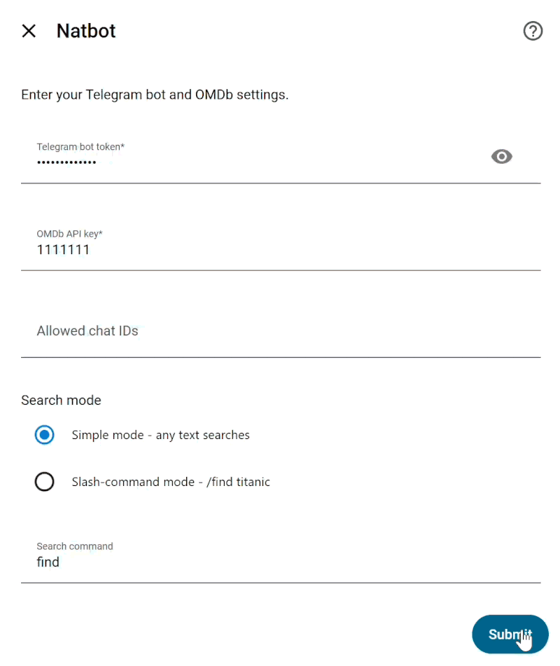

# Natbot - Telegram Media Bot for HASS

Tiny Home Assistant Telegram bot.

You say movie/series name.

Bot look. Bot find. Bot poke Radarr or Sonarr.

## What bot do

- Find movie
- Find series (bot ask which seasons: first, not first, or all )
- Add to Sonarr/Radarr with chosen quality profile

## Demo:
  

## Need things

- Home Assistant
- HACS
- [Telegram bot token](https://www.home-assistant.io/integrations/telegram_bot/#create-a-bot-in-telegram)
- [OMDb API key](https://www.omdbapi.com/apikey.aspx)
- Radarr, for movie pile and/or Sonarr, for TV pile

## Install

1. Open HACS
2. Click Integrations
3. Click three dots
4. Click Custom repositories
5. Paste this repo
6. Pick Integration
7. Install

## Config
1. Go here: Settings → Devices & services → Add integration
2. Search: Natbot
3. Fill boxes. Do not anger boxes!

## Use

- Simple mode: `titanic`. Bot goes: `yes boss`
- Command mode: `/find titanic`. Bot goes: `also yes boss`
- Next button - more movie.
- Prev button - less future, more past.
- Download - Movie go to Radarr. Show ask "which seasons?" and go to Sonarr. 

## Change stuff

Go here: Settings → Devices & services → Telegram Media Bot → Configure

Change things. Bot forget old brain. Bot get new brain.

## Warning

Not official.

Not Telegram.

Not Radarr.

Not Sonarr.

Not IMDb.

Also, I am a dog.